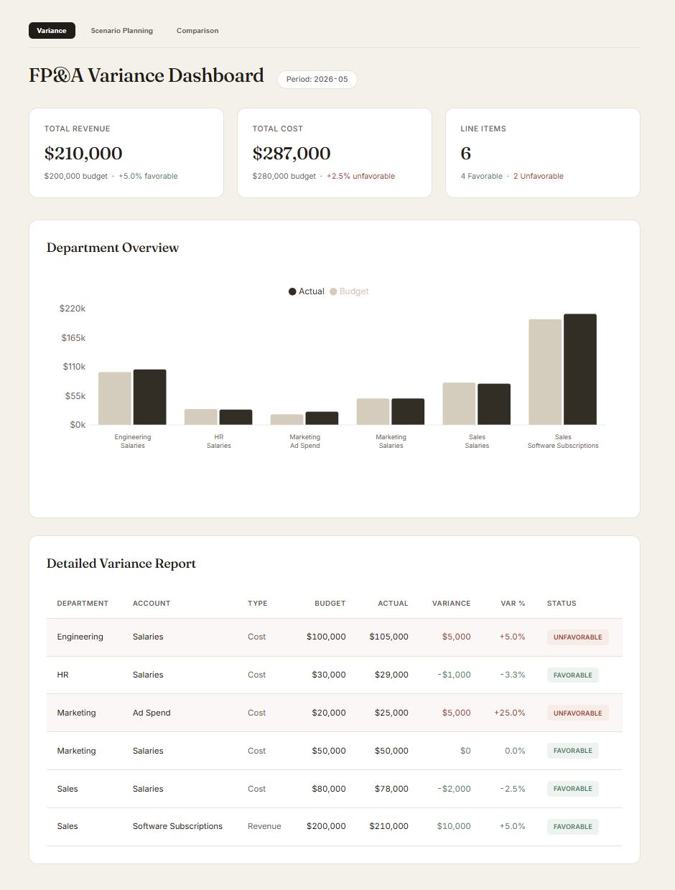
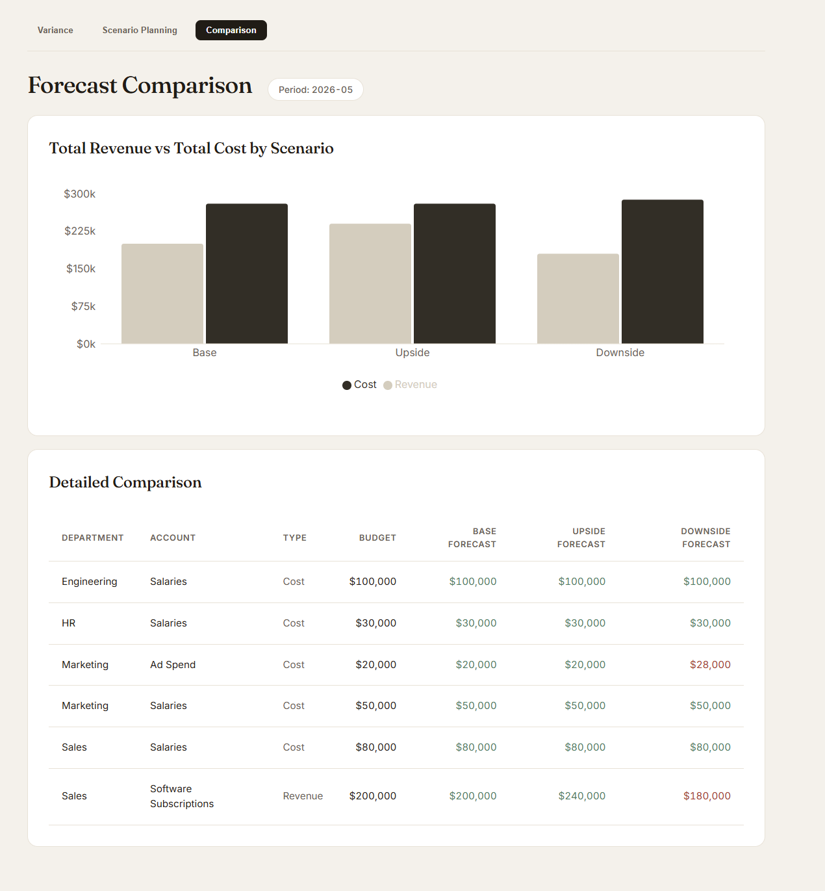
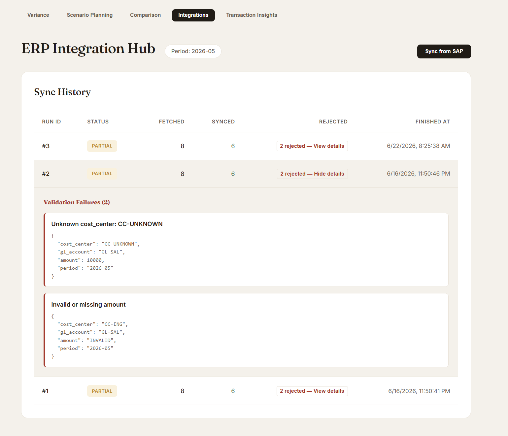
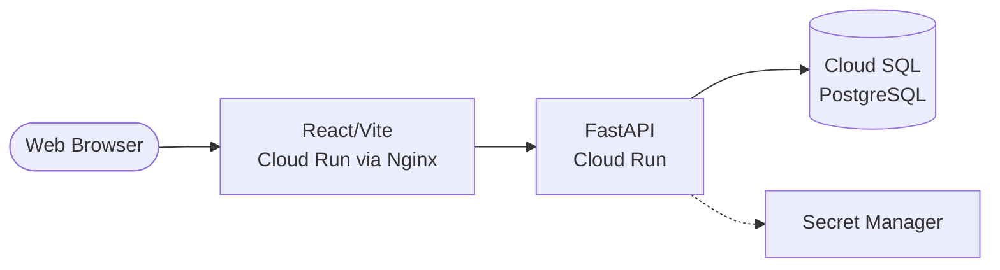

# FP&A Variance Platform

> An internal financial planning & analysis tool that computes budget-vs-actual variance, handles driver-based forecasting, supports interactive scenario modeling, and features a robust ERP/SAP integration layer for automated ingestion of actuals.

**Live demo:** https://fpa-frontend-1029461300479.asia-south1.run.app



## Overview

The FP&A Variance Platform represents the kind of robust, internal financial tooling typically built by corporate engineering teams to track departmental performance. It solves the critical business need of separating revenue and cost accounts to compute accurate variance logic, ensuring stakeholders can reliably identify positive and negative discrepancies. The application is deployed full-stack on Google Cloud.

### Scenario Planning & Forecasting



The platform features an interactive scenario modeling engine. Forecasts are dynamically computed from a set of editable driver assumptions, allowing analysts to simulate what-if scenarios (e.g., Upside vs. Downside) and compare them side-by-side against the locked baseline.

### ERP / SAP Integration



A fault-tolerant integration layer ingests actuals from a (mock) SAP source. This pipeline features strict field mapping to resolve external identifiers, idempotent upserts to safely run synchronizations multiple times, and an auditable sync log that prominently surfaces partial-success validation errors.

## Architecture



The system leverages a decoupled architecture. The React single-page application is served via an Nginx container on Google Cloud Run. It communicates with a stateless Python FastAPI backend, which relies on Google Secret Manager for secure credential injection and connects directly to a managed Cloud SQL Postgres instance via a secure Unix socket.

## Tech Stack

- **Backend:** FastAPI, SQLAlchemy, Pydantic, PostgreSQL
- **Frontend:** React, Vite, TypeScript, Recharts
- **Infrastructure:** Google Cloud Run, Cloud SQL, Secret Manager, Cloud Build
- **Tooling:** Docker, pytest

## Key Features

- **Context-Aware Variance Logic:** Computes budget-vs-actual variance with an intelligent favorable/unfavorable sign-flip based on account type (revenue over budget = favorable; cost over budget = unfavorable).
- **Driver-Based Forecasting:** Dynamically computes forecasts using a structured product-model of driver assumptions.
- **Interactive Scenario Modeling:** Supports distinct Base, Upside, and Downside scenarios with live what-if capabilities.
- **Side-by-Side Comparison:** Unified table and chart views for analyzing multiple scenario outcomes concurrently.
- **ERP/SAP Integration:** Ingests actuals from a mock SAP connector behind a swappable interface, with field mapping, idempotent upserts, partial-success validation, and an auditable sync log.
- **Streaming Data Pipeline:** Synthetic transaction events are published to Cloud Pub/Sub, aggregated by an Apache Beam streaming pipeline into fixed 60-second windows (calculating sum and count per department/account), and written to BigQuery. The pipeline was verified on Dataflow with 50,000 events reconciled exactly.
- **Separated KPIs:** High-level key performance indicator summaries that track total revenue and total cost independently.
- **Premium Visualization:** A detailed dashboard featuring interactive charts and a comprehensive table, styled with a warm, "fintech" aesthetic design system.

## Running Locally

1. **Database:** Spin up the local Postgres instance.
   ```bash
   docker-compose up -d
   ```
2. **Backend:** Initialize the Python environment, run the database seed script, and start the API from the repository root.
   ```bash
   python -m venv venv
   source venv/bin/activate  # Or venv\Scripts\activate on Windows
   pip install -r backend/requirements.txt
   
   # Set PYTHONPATH so the backend module resolves correctly
   export PYTHONPATH=.
   # On Windows PowerShell: $env:PYTHONPATH = "."
   
   python backend/seed.py
   uvicorn backend.main:app --reload
   ```
3. **Frontend:** Install dependencies and run the development server.
   ```bash
   cd frontend
   npm install
   npm run dev
   ```

## Deployment

The platform is fully containerized and deployed to Google Cloud Run, backed by a Cloud SQL PostgreSQL instance. For a detailed breakdown of the infrastructure pipeline—including specific challenges encountered during deployment and their respective solutions—please refer to the [Deployment Log](docs/deployment.md).

## Engineering Decisions

Key architectural choices are documented in the [ADR Directory](docs/adr/). Key decisions include:
- **Migrations:** Utilizing SQLAlchemy's `create_all` for rapid prototyping in Phase 1, with the explicit intent to migrate to Alembic once the data model matures and persistent schema evolution becomes necessary.
- **Environment-Driven Connectivity:** Designing the database connection layer to dynamically switch between standard TCP routing for local development and secure Unix sockets when running in the cloud.
- **Driver-Based Forecasting:** Modeling forecasts as a structured product of editable driver assumptions (rather than evaluated formula strings) to keep scenarios first-class and avoid an expression-injection surface — see [ADR-0002](docs/adr/0002-driver-based-forecasting.md).
- **ERP Integration Path:** Abstracting the integration logic behind a swappable interface and implementing a fault-tolerant partial-success ingestion model — see [ADR-0003](docs/adr/0003-erp-integration.md).
- **High-Volume Streaming Verification:** Documenting the end-to-end load testing and correctness reconciliation of the Dataflow streaming pipeline — see the [Scale Report](docs/scale-report.md).

## Roadmap

- **Phase 1:** Core application and cloud deployment (Complete).
- **Phase 2:** Driver-based forecasting and advanced scenario modeling (Complete).
- **Phase 3:** ERP/SAP integration layer for automated synchronization (Complete).
- **Phase 4:** High-throughput data pipeline (Pub/Sub -> Dataflow -> BigQuery) designed to handle millions of events per day (Complete).
