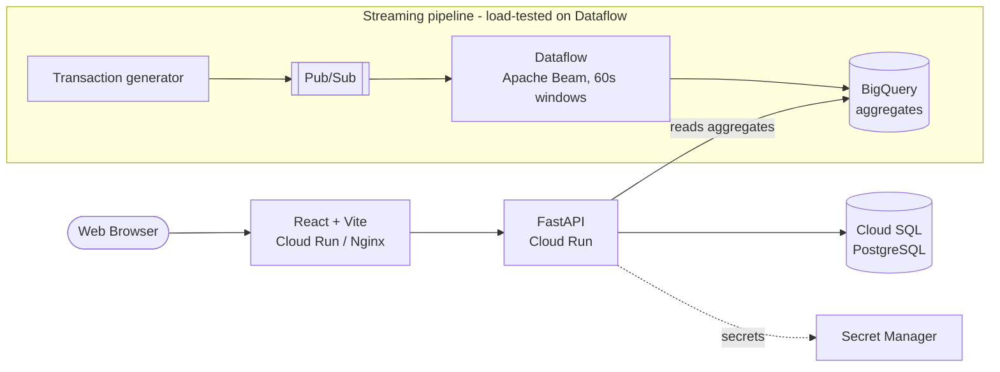

# FP&A Variance Platform


A full-stack financial planning & analysis platform: it computes budget-vs-actual variance with correct revenue/cost accounting logic, models driver-based forecast scenarios, ingests actuals through a fault-tolerant ERP/SAP integration, and runs a streaming data pipeline that was load-tested on Google Cloud Dataflow at **~724 events/sec**, with **50,000 events reconciled to the cent and zero loss**.

**[Live demo](https://fpa-frontend-1029461300479.asia-south1.run.app)** | **[Live API explorer](https://fpa-backend-1029461300479.asia-south1.run.app/docs)** | **[Architecture](#architecture)** | **[Scale report](docs/scale-report.md)**

*The demo is public and read-only. Pipeline figures come from the bounded load test documented in the scale report, not live production traffic.*


## Why this is more than a CRUD app

- **Domain-correct finance logic.** Variance isn't a naive `actual - budget`. The sign of "favorable" flips with account type: revenue *over* budget is favorable, cost *over* budget is unfavorable. That rule is the core of the product, and it's unit-tested across the edge cases (zero budget, exact match, both account types).

- **A real streaming pipeline, verified at scale.** Synthetic transactions flow through Cloud Pub/Sub, are aggregated in 60-second windows by Apache Beam on Dataflow, and land in BigQuery. A bounded load test sustained **~724 events/sec on a single worker (~62M/day extrapolated)**, and all **50,000 events reconciled exactly** against an independently computed ground truth - zero records lost. Method and numbers in the [scale report](docs/scale-report.md).

- **Fault-tolerant integration, not a happy-path demo.** The ERP/SAP ingestion layer does external-ID field mapping, idempotent upserts (safe to re-run), partial-success handling, and writes an auditable reject log when individual records fail validation.

- **Decisions are written down.** Architecture choices and their tradeoffs live as [ADRs](docs/adr/) and a [scale report](docs/scale-report.md) - the reasoning, not just the result.

## Architecture



A React single-page app is served by an Nginx container on Cloud Run and talks to a stateless FastAPI backend, also on Cloud Run. The backend pulls its database password from Secret Manager and connects to a managed Cloud SQL Postgres instance over a Unix socket. Separately, the streaming pipeline publishes transaction events to Pub/Sub, aggregates them on Dataflow, and writes them to BigQuery; the backend reads those aggregates back to power the in-app Transaction Insights view - closing the loop from raw event to dashboard.

## Features

The app ships as five modules:

**Variance dashboard** - budget-vs-actual by department and account, with the favorable/unfavorable logic and independent revenue/cost KPI rollups.

**Driver-based forecasting** - forecasts are computed as a structured product of editable driver assumptions (e.g. headcount x salary), not evaluated formula strings - which keeps scenarios first-class and avoids an expression-injection surface.

**Scenario modeling & comparison** - distinct Base, Upside, and Downside scenarios with live what-if edits, viewable side by side.


**ERP/SAP integration** - ingests actuals from a mock SAP connector behind a swappable interface, with field mapping, idempotent upserts, partial-success validation, and an auditable sync log.


**Transaction insights** - reads the pipeline's BigQuery aggregates back into the app, so the streaming work is visible and clickable in the live demo.

## Tech stack

- **Frontend:** React, Vite, TypeScript, Recharts
- **Backend:** FastAPI, SQLAlchemy, Pydantic, PostgreSQL
- **Data pipeline:** Apache Beam, Cloud Dataflow, Cloud Pub/Sub, BigQuery
- **Google Cloud:** Cloud Run, Cloud SQL, Secret Manager, Pub/Sub, Dataflow, BigQuery, Cloud Build
- **Tooling:** Docker, pytest (13 tests), GitHub Actions CI

## Engineering decisions

Tradeoffs are documented as ADRs and a scale report rather than left implicit. Full [ADR directory](docs/adr/); highlights:

- **Schema management** - `create_all` was used through the early phases for speed. Its limitation (it creates missing tables but never *alters* an existing one - which surfaced when a column was added in Phase 3) is documented as the reason the production path is versioned migrations. See [ADR-0001](docs/adr/0001-phase-1-architecture.md).
- **Environment-driven connectivity** - the database layer switches automatically between TCP for local development and a secure Unix socket on Cloud Run, from a single code path.
- **Driver-based forecasting** - forecasts modeled as a structured product of driver assumptions rather than evaluated formula strings, keeping scenarios first-class and avoiding an expression-injection surface. See [ADR-0002](docs/adr/0002-driver-based-forecasting.md).
- **ERP integration** - a swappable connector interface and a fault-tolerant, partial-success ingestion model. See [ADR-0003](docs/adr/0003-erp-integration.md).
- **Streaming verification** - end-to-end load test and exact correctness reconciliation of the Dataflow pipeline. See [ADR-0004](docs/adr/0004-streaming-pipeline.md) and the [scale report](docs/scale-report.md).

## Running locally

1. Start Postgres:
   ```bash
   docker-compose up -d
   ```
2. From the repository root, install dependencies, seed the database, and run the API:
   ```bash
   pip install -r backend/requirements.txt

   # Make the backend module resolve from the repo root:
   export PYTHONPATH=.          # macOS/Linux
   # $env:PYTHONPATH = "."      # Windows PowerShell

   python backend/seed.py
   uvicorn backend.main:app --reload
   ```
3. Frontend:
   ```bash
   cd frontend
   npm install
   npm run dev
   ```

`seed.py` is destructive (it drops and recreates tables) and is intended as a local dev convenience.

## Deployment

The platform is containerized and deployed to Cloud Run over Cloud SQL. The [deployment log](docs/deployment.md) records the real issues hit during deployment and how each was resolved.

## Status

- **Phase 1** - core variance app + cloud deployment - Complete
- **Phase 2** - driver forecasting + scenario modeling - Complete
- **Phase 3** - ERP/SAP integration layer - Complete
- **Phase 4** - streaming pipeline (Pub/Sub -> Dataflow -> BigQuery), load-tested - Complete
- **Phase 5** - CI (GitHub Actions runs 13 tests on every push) - Complete; further hardening ongoing

## License

MIT - see [LICENSE](LICENSE).